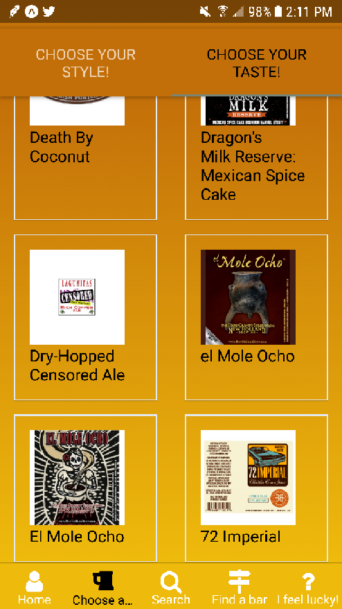

# Readme

## Welcome to Stumbr!

Stumblr is an intelligent beer recommendation application for Android and iOS built with React Native and powered by Firebase.

It allows a user to track which beers they like and dislike, how many times they've has them...

as well as allowing them to browse by style and flavor.

The recommendation engine compares the user's inputs against flavor keywords to identify the beers within the database which match the user's stated preferences. It combines this information with user behavior to show informed recommendations for your tastes.

Yelp integration shows the user bars nearest to them to encourage engagement with the app:

If you know what you're looking for you can search for it...

... here we're looking for different varieties of Bud:

Contact one of the contributors with any bug reports or change requests.
